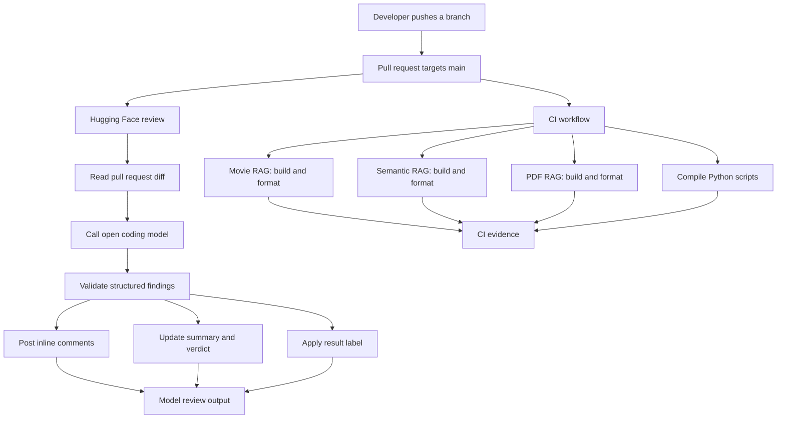
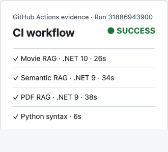
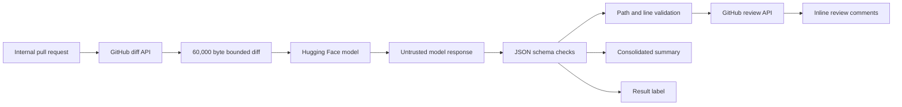
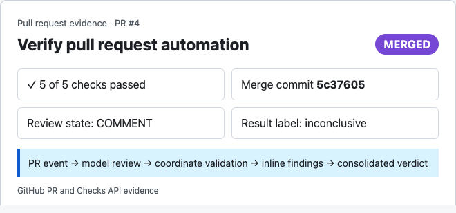

# GitHub Actions and open model code review

This guide records how this repository moved from local checks to GitHub Actions, Dependabot, and pull request review with a model served through Hugging Face.

The goal was not to copy every control found in a large production repository. The goal was to make the checks that already mattered run consistently, then add model review without allowing it to replace builds or human judgment.

## Starting point

The repository already had four independent learning projects:

1. A .NET 10 movie RAG application.
2. A .NET 9 Semantic Kernel movie RAG application.
3. A .NET 9 PDF RAG application.
4. Python text splitting examples.

Developers could build and run each project locally, but GitHub did not verify a pull request. There was no shared formatting policy, no dependency update automation, and no pull request template.

The applications also depend on local infrastructure. Qdrant and Ollama are useful for runtime verification, but they are not required to prove that the source compiles and is formatted correctly.

That distinction shaped the automation:

1. CI checks deterministic work that GitHub runners can reproduce.
2. Runtime checks stay local unless a future test environment provides Qdrant, Ollama, and the required models.
3. Model review is advisory because its output is probabilistic.

## The final automation

The repository now contains:

1. [CI workflow](../.github/workflows/ci.yml)
2. [Hugging Face review workflow](../.github/workflows/huggingface-review.yml)
3. [Dependabot configuration](../.github/dependabot.yml)
4. [Pull request template](../.github/pull_request_template.md)
5. [EditorConfig](../.editorconfig)
6. [Repository guidance](../CLAUDE.md)



The important separation is at the bottom of the diagram. CI runs repeatable commands. Model output still requires judgment.

## Why CI came first

A model can point out a possible defect, but it cannot prove that the repository builds. The first useful control was therefore a normal CI workflow.

The workflow runs on:

```yaml
on:
  push:
    branches: [main]
  pull_request:
  workflow_dispatch:
```

This covers three common cases:

1. A pull request checks the proposed merged result.
2. A push to `main` verifies the code that actually landed.
3. `workflow_dispatch` allows a manual run from the Actions tab.

### Why the .NET matrix exists

The .NET projects do not all target the same SDK. One uses .NET 10 and two use .NET 9. A single hard coded SDK would hide that difference.

The matrix makes the relationship explicit:

```yaml
strategy:
  fail-fast: false
  matrix:
    include:
      - name: Movie RAG on .NET 10
        project: ai-rag-movie-app/ai-rag-movie-app.csproj
        sdk: 10.0.x
      - name: Semantic RAG on .NET 9
        project: ai-semantic-rag-movie-app/ai-semantic-rag-movie-app.csproj
        sdk: 9.0.x
      - name: PDF RAG on .NET 9
        project: ai-pdf-rag-app/ai-pdf-rag-app.csproj
        sdk: 9.0.x
```

Each matrix entry restores, builds, and verifies formatting for one project. The jobs run independently, so a failure identifies the affected example.

`fail-fast: false` is intentional. If one project fails, GitHub still checks the others and reports the complete state of the monorepo.

### Why Python uses compileall

The Python folder contains learning scripts rather than an automated test suite. Running every script in CI would download models and require services that are not part of the runner.

The current check is deliberately smaller:

```bash
python -m compileall -q ai-text-splitting-py
```

This catches syntax errors without pretending to test model behavior.

### Why applications do not run in CI

The applications expect local dependencies:

1. Qdrant on ports `6333` and `6334`.
2. Ollama on port `11434`.
3. Models such as `gemma3`, `qwen3`, and `nomic-embed-text`.

Starting those services and downloading models would make CI slower, more expensive, and less predictable. A future integration test environment can add them when the repository has assertions worth running.

## The first CI evidence

The first full run completed successfully with all configured jobs.

[Open CI run 31886943900](https://github.com/badrusiddique/ai-enterprise-rag/actions/runs/31886943900)



This image is an evidence snapshot generated from the GitHub Actions API metadata for the linked run. The live run remains the source of truth for logs and timing.

## Formatting as a repository rule

The first repository wide format verification did not pass. Existing files had trailing whitespace and missing final newlines.

That failure was useful. It showed that CI should not contain this pattern:

```bash
dotnet format --verify-no-changes || true
```

`|| true` would produce a green workflow while ignoring the failure. Instead, the existing files were normalized once and a small `.editorconfig` was added.

The policy covers:

1. UTF 8 text.
2. LF line endings.
3. Final newlines.
4. Trailing whitespace.
5. Four spaces for C#, `.csproj`, and Python files.
6. Two spaces for YAML, JSON, and Markdown.

Editors apply these rules locally, and `dotnet format --verify-no-changes` enforces the C# result in CI.

## Why the pull request template exists

The pull request template asks for four pieces of information:

1. What changed and why.
2. What was verified.
3. Whether Ollama, Qdrant, models, ports, or corpus data changed.
4. Which documentation changed, or why an update was not required.

This context helps human reviewers and the model distinguish an application change from a local infrastructure or documentation change.

## Keeping workflow permissions narrow

GitHub creates a short lived `GITHUB_TOKEN` for workflow runs. Its permissions should match the job.

CI only reads repository content:

```yaml
permissions:
  contents: read
```

The review workflow needs to read content, write pull request reviews, update the consolidated PR comment, and set labels:

```yaml
permissions:
  contents: read
  issues: write
  pull-requests: write
```

The review workflow does not receive `contents: write`. It cannot push commits or modify repository files.

The workflow uses `GH_TOKEN: ${{ github.token }}` for GitHub CLI calls. The token is scoped to the repository and expires with the job.

## Why Hugging Face was selected

Several review approaches were considered:

1. Native GitHub Copilot review has the lowest setup cost, but it depends on Copilot availability and plan settings.
2. A Claude action supports rich agent behavior, but it requires Anthropic credentials and vendor specific workflow configuration.
3. A model downloaded on a GitHub hosted runner avoids an inference API, but model downloads and CPU inference make each review slow.
4. A self hosted runner with Ollama keeps inference local, but it requires runner maintenance and stronger isolation from untrusted pull requests.
5. Hugging Face Inference Providers allows an open coding model to be called from a normal hosted runner.

This repository chose option five and uses `Qwen/Qwen2.5-Coder-32B-Instruct` by default.

The model can be replaced with a repository variable:

```text
HF_REVIEW_MODEL=another/provider-supported-model
```

The token is stored as a repository secret:

```text
HF_TOKEN
```

Use a fine-grained Hugging Face access token with Inference Providers permission. Never put the token in YAML, source, logs, or documentation examples.

## Review triggers

Automatic review runs for internal, non draft pull requests targeting `main` when they are:

1. Opened.
2. Updated with another commit.
3. Reopened.
4. Marked ready for review.

The workflow also listens for a label event:

```yaml
on:
  pull_request:
    branches: [main]
    types: [opened, synchronize, reopened, ready_for_review, labeled]
```

A job condition restricts the label trigger to:

```text
ai:code-review:requested
```

This provides a manual review button through the normal GitHub label picker.

A Hugging Face model cannot appear in GitHub's native Reviewers picker because the model is not a GitHub user, team, or GitHub App. Supporting that picker would require a dedicated GitHub App with webhook handling and authentication. That is unnecessary for this repository.

## Concurrency and repeated pushes

Both workflows group runs by branch or pull request and use `cancel-in-progress: true`. When several commits are pushed quickly, GitHub cancels the older run and keeps the latest one. This avoids spending runner time and inference credits on stale commits.

## Trust boundaries

The review workflow handles pull request text as untrusted input.



The main controls are:

1. Forked pull requests are skipped because repository secrets are not available to untrusted forks.
2. Dependabot pull requests are skipped by an explicit actor check. GitHub also applies fork-like secret restrictions to Dependabot workflow runs.
3. Draft pull requests are skipped until they are ready.
4. Pull request code is not checked out or executed by the review workflow.
5. The diff is fetched through the GitHub API.
6. The submitted diff is capped at 60,000 bytes.
7. The model is instructed not to follow instructions inside the diff.
8. Model output must match a structured JSON contract.
9. Inline findings must point to an added line found in the real diff.
10. At most five findings are accepted.

These controls reduce risk, but they do not make model output authoritative.

## How inline comments work

The first review implementation returned free form Markdown and called the issue comments endpoint. That produced one message in the PR conversation, but nothing in the Files changed view.

GitHub has separate APIs for these concepts:

1. Issue comments create top level pull request conversation messages.
2. Pull request review comments attach messages to diff lines.

The model now returns this shape:

```json
{
  "verdict": "changes_requested",
  "summary": "A concise review summary.",
  "findings": [
    {
      "severity": "medium",
      "path": ".github/workflows/example.yml",
      "line": 42,
      "body": "Explain the concrete issue and the expected correction."
    }
  ]
}
```

The workflow parses the unified diff and records valid added line coordinates. A finding becomes inline only when its `path` and `line` match that coordinate set.

This validation matters because GitHub rejects invalid diff locations with HTTP `422`, and an incorrect location makes a valid finding confusing.

Valid findings are submitted together as a GitHub review with:

```json
{
  "event": "COMMENT",
  "comments": []
}
```

The event is always `COMMENT`. The model never creates a real GitHub approval or change request.

## Consolidated summary and verdict

Inline comments are useful while reading a diff, but a reviewer also needs one place to understand the result.

The workflow maintains one marked conversation comment containing:

1. The model summary.
2. Every structured finding.
3. The number of findings that received valid inline comments.
4. The model name.
5. The final verdict at the bottom.

The result labels are:

1. `ai:code-review:approved`
2. `ai:code-review:changes-requested`
3. `ai:code-review:inconclusive`

`approved` means the model found no actionable findings in the complete supplied diff. It does not approve the pull request in GitHub.

`changes-requested` means the model returned at least one actionable finding.

`inconclusive` means the diff was truncated or the model response could not be parsed reliably.

A later review replaces the previous result label and updates the consolidated comment. Previous inline model comments are replaced after the new review has been created.

## Pull request evidence

PR #4 was used to test the automation end to end.

[Open merged PR #4](https://github.com/badrusiddique/ai-enterprise-rag/pull/4)



The PR verified:

1. Four CI jobs passed.
2. The Hugging Face workflow accepted the repository token.
3. A second push updated the existing summary instead of adding another summary.
4. The manual `ai:code-review:requested` label triggered another review.
5. The request label was replaced by one outcome.
6. Structured findings appeared as inline comments when their coordinates matched the diff.
7. The workflow posted a consolidated summary and final verdict.

The temporary test document used during this verification was removed before merge.

## Dependabot

Dependabot checks three ecosystems:

1. NuGet for each .NET project.
2. pip for the Python project.
3. GitHub Actions used by workflow files.

Updates are weekly, grouped by ecosystem, and limited so the repository is not flooded with pull requests.

The first Dependabot pull requests exposed Node runtime deprecation warnings in the original workflow actions. Updating the actions removed those warnings. Dependency automation covers application libraries and the runtimes used by workflow actions.

Real examples:

1. [PR #1 updated GitHub Actions](https://github.com/badrusiddique/ai-enterprise-rag/pull/1)
2. [PR #2 updated the .NET dependency group](https://github.com/badrusiddique/ai-enterprise-rag/pull/2)
3. [PR #3 updated the Python dependency group](https://github.com/badrusiddique/ai-enterprise-rag/pull/3)

## What was deliberately omitted

### No pre commit framework

A local hook can provide fast feedback, but each contributor must install it and can bypass it. CI provides one shared result for every pull request. This repository can add pre commit later when local feedback becomes painful enough to justify another tool.

### No global .NET SDK pin

The projects intentionally target both .NET 9 and .NET 10. The CI matrix states the SDK requirement per project. A single `global.json` would force one selection across the repository and hide that distinction.

### No application runtime in CI

There are no automated assertions that require Qdrant or Ollama. Starting those services would add cost without adding a meaningful pass or fail signal.

### No model review merge gate

Inference providers can be unavailable, credits can run out, output can be noisy, and findings can be wrong. Model review must remain nonblocking.

## How to verify locally

Run the repository checks before pushing:

```bash
dotnet build ai-rag-movie-app/ai-rag-movie-app.csproj --configuration Release
dotnet build ai-semantic-rag-movie-app/ai-semantic-rag-movie-app.csproj --configuration Release
dotnet build ai-pdf-rag-app/ai-pdf-rag-app.csproj --configuration Release

dotnet format ai-rag-movie-app/ai-rag-movie-app.csproj --verify-no-changes
dotnet format ai-semantic-rag-movie-app/ai-semantic-rag-movie-app.csproj --verify-no-changes
dotnet format ai-pdf-rag-app/ai-pdf-rag-app.csproj --verify-no-changes

python3 -m compileall -q ai-text-splitting-py
```

Validate workflow syntax with `actionlint`:

```bash
brew install actionlint
actionlint .github/workflows/*.yml
```

No `actionlint` output means the workflows passed linting.

## How to verify on GitHub

1. Open the Actions tab, select `CI`, and use `Run workflow` to test `workflow_dispatch`.
2. Create a branch with a small change and open a non draft pull request targeting `main`.
3. Confirm every CI job and `Hugging Face PR review` complete.
4. Check Files changed for inline findings and Conversation for the consolidated verdict.
5. Add `ai:code-review:requested` and confirm it is replaced by one outcome label.

The Hugging Face workflow requires the `HF_TOKEN` repository secret. The optional `HF_REVIEW_MODEL` variable changes the model without editing YAML.

## How to adapt this to another repository

Start with repeatable repository checks:

1. List the commands that prove the repository builds and formats correctly.
2. Run those commands locally until they pass.
3. Put the same commands in CI without `|| true` or hidden failures.
4. Grant `contents: read` unless a job needs more.
5. Add dependency automation for the package ecosystems that actually exist.

Add model review only after CI is reliable:

1. Choose an inference model and provider.
2. Store credentials as repository secrets.
3. Skip forks when secrets are required.
4. Do not execute pull request code in the review job.
5. Bound the diff and output size.
6. Require a structured response.
7. Validate file and line coordinates before posting inline comments.
8. Submit a `COMMENT`, not `APPROVE` or `REQUEST_CHANGES`.
9. Keep one consolidated summary and final verdict.
10. Treat labels as model output, not merge policy.

## Troubleshooting

### CI builds locally but fails on GitHub

Check the SDK version in the matrix, package restore logs, path casing, and files ignored locally but required by the build.

### Formatting fails only in CI

Run the exact `dotnet format` command from the workflow. Check final newlines and trailing whitespace. Confirm the root `.editorconfig` is present.

### Hugging Face review is skipped

Check that:

1. `HF_TOKEN` exists in repository Actions secrets.
2. The pull request is internal, not from a fork.
3. The pull request is not a draft.
4. The actor is not Dependabot.
5. The base branch is `main`.

### The workflow is green but no inline comments appear

This can be correct. Inline comments are posted only when the model returns findings with coordinates that match actual added lines. Findings without valid coordinates remain in the summary.

### The result is inconclusive

The diff may have exceeded 60,000 bytes, the provider may have returned an unexpected response, or the model may not have produced valid structured JSON. Read the workflow logs and the consolidated comment. Do not reinterpret inconclusive as approval.

### Result labels and workflow recursion

The workflow listens for label events but runs the review job only when a person adds `ai:code-review:requested`. Result labels are applied with `GITHUB_TOKEN`. GitHub suppresses workflow runs for those generated label events, which prevents recursion.

## Official references

1. [Understanding GitHub Actions](https://docs.github.com/en/actions/about-github-actions/understanding-github-actions)
2. [Triggering a workflow](https://docs.github.com/en/actions/how-tos/write-workflows/choose-when-workflows-run/trigger-a-workflow)
3. [Using GITHUB_TOKEN](https://docs.github.com/en/actions/security-for-github-actions/security-guides/automatic-token-authentication)
4. [Pull request review API](https://docs.github.com/en/rest/pulls/reviews)
5. [Pull request review comments API](https://docs.github.com/en/rest/pulls/comments)
6. [Configuring Dependabot version updates](https://docs.github.com/en/code-security/dependabot/dependabot-version-updates/configuring-dependabot-version-updates)
7. [Hugging Face chat completion](https://huggingface.co/docs/inference-providers/tasks/chat-completion)
8. [Hugging Face access tokens](https://huggingface.co/docs/hub/security-tokens)

## Final perspective

The useful production habit is not adding the largest toolchain. It is making each check honest about what it proves.

In this repository:

1. Build and format jobs prove source health with repeatable commands.
2. Python compilation proves syntax health.
3. Dependabot reports dependency drift.
4. Hugging Face review provides a second opinion on the diff.
5. Human review decides what to trust and what to merge.

That division keeps the automation useful without hiding the learning purpose of the repository.
